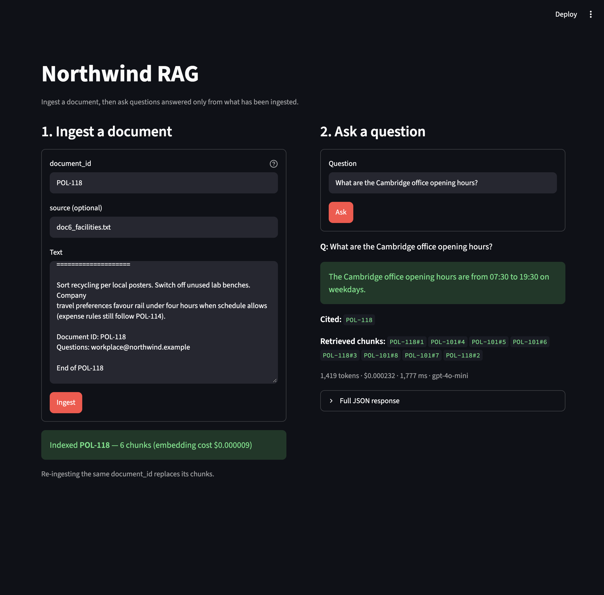
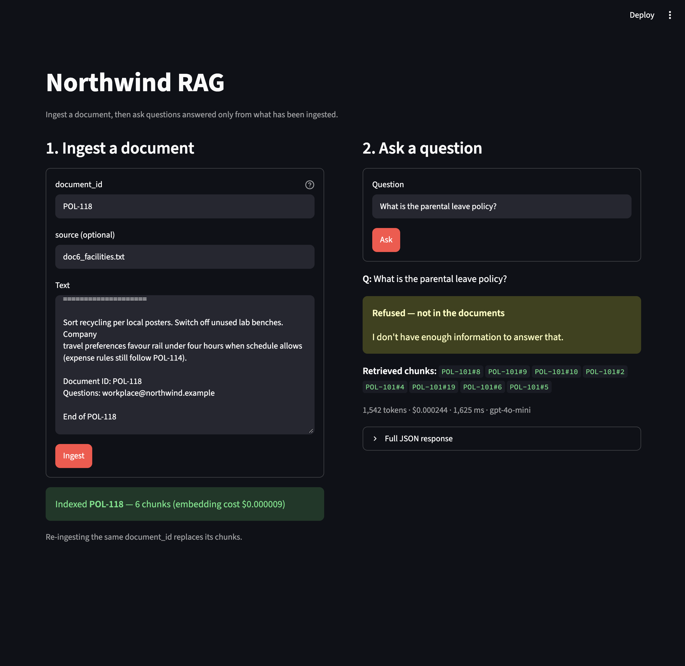

# ask-rag

A question-answering API that answers only from the documents you give it. Every
answer cites the document it came from, and when the documents don't contain the
answer, it says so instead of guessing.

Built during week 2 of an AI engineering bootcamp, October 2026. It extends the
`/ask` service from week 1 ([ask-ui](https://github.com/ChiaraQui/ask-ui) is its
front end).



## What it does

You send documents to `POST /ingest`. The service splits them into chunks, turns
each chunk into an embedding and stores it in Pinecone. When you ask a question,
`POST /ask` finds the eight most similar chunks, gives only those to the model, and
returns a typed answer:

```json
{
  "answer": {
    "answer": "Employees may work remotely up to three days per week.",
    "confidence": 1.0,
    "sources_needed": false,
    "refused": false,
    "citations": ["POL-101"]
  },
  "tokens_used": 1398,
  "model": "gpt-4o-mini",
  "latency_ms": 4671,
  "cost_usd": 0.000225,
  "retrieved_chunk_ids": ["POL-101#7", "POL-101#5", "POL-101#6", "POL-101#8", "POL-101#10", "POL-114#4", "POL-101#9", "SPEC-WB9#8"]
}
```

`citations` says which document the answer relies on. `retrieved_chunk_ids` shows
everything the model was given, so you can check the answer against its sources.
Ask about something the documents don't cover and you get
`"refused": true`, no citations, and "I don't have enough information to answer
that."



The test corpus is a fictional company's policy pack provided by the bootcamp: an
employee handbook, expenses, security, IT and facilities policies, and a product
spec. Six documents, 73 chunks. It's course material, so it isn't included here
(see *Running it*).

## Architecture

| Part | Stack | Hosting |
|---|---|---|
| API | FastAPI, Pydantic, OpenAI SDK | Render |
| Vector store | Pinecone (serverless, cosine, 1536 dimensions) | Pinecone free tier |
| Embeddings | `text-embedding-3-small` | OpenAI |
| Generation | `gpt-4o-mini` | OpenAI |
| UI | Streamlit, calling the API over HTTP | local |

The UI has no retrieval logic of its own. It sends requests to `/ingest` and `/ask`
and displays what comes back, so the API stays the single source of truth.

## Decisions

The numbers below come from testing against the six documents.

**Retrieval was tested on its own before the model was involved.**
`GET /debug/retrieve?q=...` returns the top chunks and their similarity scores
without calling the LLM. If the right passage isn't retrieved, no prompt will
produce a good answer, so I checked retrieval first and only then changed `/ask`.
Every problem below was found this way, by asking a question and comparing the
results with the source document.

**Chunks follow the document's sections, not just a character count.** With plain
800-character chunks, "What are the company's values?" returned as its top result
a chunk that ended with the heading "2. OUR COMPANY AND VALUES" and contained none
of the values (score 0.50). The values themselves were split over two chunks, and
the fourth one, "Teach what you learn", didn't make the top five. An answer built
from those chunks would have listed three values out of four without any warning.
Now each document is split at its section headings first, then by length inside
each section, and every chunk starts with its document and section title. All four
values come back in one chunk, ranked first (0.55, with the next chunk at 0.39).

**The model sees eight chunks, not five.** The chunking change had a cost. The £350
home office allowance in the handbook dropped from 2nd to 5th place, behind four
expense-policy chunks that share the word "claim". With five chunks it was one
place from being dropped. Eight chunks keep a margin for passages like this one.
The extra context makes a question cost about $0.0003, against about $0.00002 for
the week 1 service with no retrieval.

**The model decides when to refuse, not a score threshold.** The obvious approach
is to refuse when the best similarity score is low. It doesn't work here. "What is
the parental leave policy?" has no answer in the documents, yet its best chunk
scored 0.51, higher than the answerable values question before the chunking fix
(0.50). Similarity measures whether a chunk is about the same topic, and annual
leave is the same topic as parental leave. So the prompt tells the model to answer
only from the passages and to refuse when they don't contain the answer. It refused
the parental leave question, and two others the documents don't cover (pensions and
company cars).

**Citations are checked in code.** The model sometimes cites a chunk ID
(`POL-114#3`) instead of the document ID (`POL-114`). In a direct test it did this
in one run out of three. The service reduces chunk IDs to their document, drops any
citation for a document the model wasn't given, and returns no citations with a
refusal.

**Documents keep stable IDs.** Each chunk is stored as `<document_id>#<n>`, and
ingesting a document deletes its previous chunks first. Running the full ingest
twice gives the same 73 chunks, not 146. This mattered early on: a one-line test
document called `handbook` outranked the real handbook for "How many remote days
are allowed?" and had to be removed.

**Pinecone rather than a local vector store.** The API runs on Render's free tier,
where the local disk is wiped on every restart and deploy. A local Chroma folder
would lose the index each time. Pinecone keeps it, and the same index serves both
local development and the deployed service.

**No public live endpoint.** The API has no authentication, and `/ingest` can now
overwrite documents as well as spend credit. The URL stays out of this repository.

## Evaluation

[`eval_golden.py`](eval_golden.py) runs eight questions against the service: six
with known answers and two that the documents don't answer. It checks three things
separately, so a failure points at the stage that broke:

- **Retrieval hit:** a chunk from the expected document containing the evidence
  sentence (for example "45 pence per mile") is in the top five. No LLM.
- **Faithful:** an LLM judge reads the eight passages the model was given and the
  answer, and checks that every claim is supported. I tested the judge by giving it
  an answer with an invented claim, which it marked as ungrounded.
- **Correct:** the answer contains the expected facts and cites the expected
  document. Plain string checks.

| # | Question | Expected | Cited | Retrieval hit | Faithful | Correct |
|---|---|---|---|---|---|---|
| 1 | How many remote days are allowed? | Up to 3 days a week | POL-101 | ✅ rank 2 | ✅ | ✅ |
| 2 | What is the mileage rate? | 45p a mile over 50 miles | POL-114 | ✅ rank 1 | ✅ | ✅ |
| 3 | How quickly must a lost laptop be reported? | Within 1 hour | POL-207 | ✅ rank 1 | ✅ | ✅ |
| 4 | What is the WB-9 payload limit? | 25 kg | SPEC-WB9 | ✅ rank 1 | ✅ | ✅ |
| 5 | What are the company's values? | All four values | POL-101 | ✅ rank 1 | ✅ | ✅ |
| 6 | How much can I claim for home office equipment? | £350 every 36 months | POL-101 | ✅ rank 5 | ✅ | ✅ |
| 7 | What is the parental leave policy? | Refuse | none | n/a | ✅ | ✅ refused |
| 8 | Do employees get a company car? | Refuse | none | n/a | ✅ | ✅ refused |

Retrieval hit 6/6, faithful 8/8, correct 8/8. One run costs about $0.003. Full
answers are in [`eval_results.md`](eval_results.md).

## Running it

```bash
python -m venv .venv
source .venv/bin/activate
pip install -r requirements.txt
cp .env.example .env          # OPENAI_API_KEY, PINECONE_API_KEY, PINECONE_INDEX
```

The Pinecone index is created on first use if it doesn't exist (1536 dimensions,
cosine, AWS us-east-1).

`ingest_northwind.py` and `eval_golden.py` expect the course's six sample documents
in `docs/northwind/`. With your own documents, send them to `POST /ingest` and
replace the questions in `eval_golden.py`.

```bash
uvicorn main:app --reload          # API on http://127.0.0.1:8000
python ingest_northwind.py         # load the six sample documents
streamlit run rag_ui.py            # UI on http://localhost:8501
python eval_golden.py              # golden-set evaluation
```

`ingest_northwind.py`, `eval_golden.py` and the UI (`ASK_API_URL`) default to the
local API and accept a deployed URL instead.

| Endpoint | Purpose |
|---|---|
| `POST /ingest` | `{document_id, text, source?}`: chunk, embed and store a document |
| `POST /ask` | `{question}`: retrieve, answer from the passages, cite or refuse |
| `GET /debug/retrieve?q=&k=` | Top-k chunks and scores, without calling the LLM |
| `GET /debug/pinecone` | Is the index reachable, and does it match the embedding model? |

## Layout

```
main.py                # FastAPI app: /ingest, /ask, /debug routes, structured output
rag.py                 # chunking, embeddings, Pinecone, retrieval, grounding prompt
rag_ui.py              # Streamlit UI for ingest and ask
ingest_northwind.py    # load the sample documents through POST /ingest
eval_golden.py         # golden-set evaluation, writes eval_results.md
docs/                  # screenshots (the sample corpus is not included)
```

## Provenance

Being precise about what is mine:

- **The `/ask` service** started as the bootcamp's week 1 starter: structured
  output with Pydantic, a validation retry, a per-request model choice and a cost
  readout. My week 1 changes are listed in the
  [ask-ui README](https://github.com/ChiaraQui/ask-ui#provenance).
- **The grounding prompt** is the course's template, word for word, with one
  paragraph added that tells the model how to fill the `refused`, `citations`,
  `confidence` and `sources_needed` fields.
- **The Northwind documents** are a fictional sample corpus provided by the course.
  They aren't redistributed in this repository.
- **Everything else is mine:** the chunking, storage and retrieval in `rag.py`,
  `/ingest`, the debug routes, the retrieval-first `/ask` with its citation checks,
  the Streamlit UI, the ingest script and the evaluation.
- Written with AI assistance, reviewed and tested by me.

## Limitations

Known, not hidden:

- **No authentication.** Anyone with the URL could ingest, overwrite or query
  documents. This is the first thing to add for real use.
- **The section splitter expects the sample documents' heading format** (a title
  between two lines of `=` signs). Documents without it fall back to plain
  length-based chunks. Markdown headings and PDFs aren't handled.
- **The evaluation is small and not independent.** Eight questions, written by me,
  about the same documents I tuned against. The judge is the same model that writes
  the answers. It's a check that catches regressions, not a benchmark.
- **Every question costs a model call, even off-topic ones.** There's no score
  threshold to refuse obviously unrelated questions early.
- **`confidence` is self-reported.** The model gave 1.0 to every answer in testing,
  so it says nothing about correctness.
- **One shared document set.** All callers search the same index. There are no
  per-user collections and no metadata filters.
- **Counts lag after ingest.** Pinecone takes a few seconds to update its vector
  count after an upsert.
